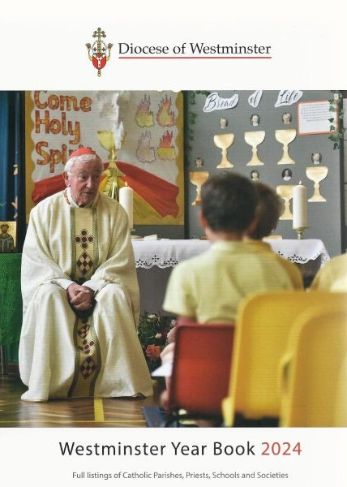
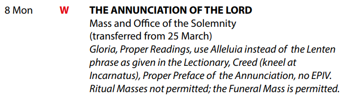
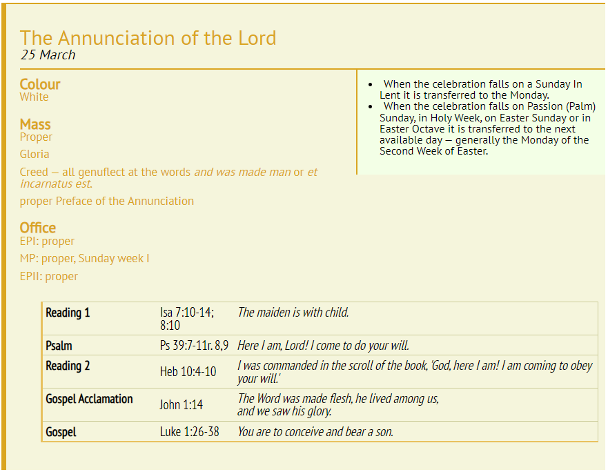

```{css float-right-figure-caption, echo = FALSE}
.my-right-figure {
  display: table;
  float: right;
  padding-left: 30px;
  padding-bottom: 10px;
}

.figure {
  display: contents;
}
```

```{css float-left-figure-caption, echo = FALSE}
.my-left-figure {
  display: table;
  float: left;
  padding-right: 30px;
  padding-bottom: 10px;
}

.figure {
  display: contents;
}
```

# 1. Introduction

Understanding the Roman Missal is key to understanding the Mass, and the MC needs to have a working understanding of it to know how to set the ribbons for Mass.

In this interactive file we will review the structure of the Mass, introduce the Missal and its structure, and set through how to set the ribbons.

## Prerequisites

Module 1 - Introduction to being an MC

## Objectives

On completion of this module, the prospective junior MC will understand:

-   where to find information about what Mass to prepare for
-   a revision on the structure of the Mass
-   the structure of the Roman Missal
-   how to set the ribbons for a regular Sunday Mass
-   how to set the ribbons for a saint's memorial, or saturday devotion to the Blessed Virgin Mary

# 2. How do I know what to prepare for?

So you've been asked to MC a Mass, and you need to know what to prepare for. Where do you find the information about what Mass it is, what colour it is, and if there are any special considerations?

Let us go over some sources.

## The Westminster Year Book

::: my-right-figure
```{r echo=FALSE, out.width='100%', fig.align='right'}

```
:::

This should be your first thought when looking for information about what Masses to prepare for, and I would strongly advise you purchase a personal copy. It is only `r knitr::asis_output("\u00A3")`5, and has a wealth of other information on parishes, clergy, and diocesan contacts, as well as what is of interest to us right now: The Ordo.

The Ordo is the calendar for the entire year, listing:

-   what the intention is for each day, such as a saint's feast day or memorial
-   what colour the Mass is
-   what other elements of the Mass are required that might be forgotten, such as if there is a Gloria or Creed.

At Our Lady of Fatima we keep a copy of this in the top drawer of the press in the Sacristy, but to get your own copy you can check the repository. If they don't have any available, you can get one from St Pauls Bookstore next to Westminster Cathedral, or [from their website](https://stpauls.org.uk/westminster-year-book-2024-paperback.html).

## The Ordo
The back section of the Westminster Year Book is "The Ordo". [A version of just this is also available online](https://rcdow.org.uk/att/files/liturgical%20calendar/liturgical%20calendar%202024.pdf), but I still suggest you get a physical copy! 

Let's take a look one entry: Monday 8th April, "The Annunciation of the Lord". This is found on page 326 of the physical book, and page 42 of the online version.

```{r echo=FALSE, out.width='100%'}

```

* The red W means the colour is white. 
* The key to the calendar (p298 physical copy, p14 online) says that **BOLD UPPER CASE TEXT** means it is a solemnity, so we now know the rank of the feast (solemnity).
* "Mass and Office of the Solemnity" means that there is a proper Mass for for this day. As we will see later this tells us where to find the information in the Missal. "Office" here means the "Divine Office", which is the daily prayer said by all clergy.
* The Gloria is said.
* The Creed is said, and rather than bowing at "And by the Holy Spirit was incarnate of the Virgin Mary, and became man", everyone kneels.
* There are readings which are unique to this celebration (this is what "proper" means), and should be used instead of those for Monday of the Second Week of Easter, but it does say to use "Alleluia" instead of the phrase given in the Lectionary (which is the book of readings for the Mass).
* The preface of the Mass is proper, as in specific for this celebration. Again this will make more sense later.
* Eucharistic Prayer 4 ("EPIV") is not allowed. We will see later that this is because there is a proper preface.
* Ritual Masses are not allowed, so no sacramental masses like Baptisms, Confirmations, Marriages etc, except for funerals.

Wow, that's a lot of information given in a small package!

## Liturgy Office calendar

::: my-right-figure
```{r echo=FALSE, out.width='100%', fig.align='right'}

```
:::

Another good source is the Liturgy Office for England and Wales. [Their website](https://www.liturgyoffice.org.uk/index.shtml) has lots of useful information for the MC, and in particular they also have a calendar. [Here is their entry for the Annunciation](https://www.liturgyoffice.org.uk/Calendar/Sunday/OT2Solemnities.shtml#Annunciation).

You may look at this and think 'Oh, this seems so much more detailed than the year book' but please consider that this only has the feasts and memorials for England and Wales. Each diocese also has days and events that are unique to just their diocese, and will not appear on the Liturgy Office website. 

Despite this, it is a very useful resource.

<div class="QuestionDiv">

---

### {- .tabset .tabset-pills .tabset-fade }

#### Question

Your turn! Find Sunday 23rd July 2024 in the [online Ordo](https://rcdow.org.uk/att/files/liturgical%20calendar/liturgical%20calendar%202024.pdf).

* What Masses are indicated for this day?
* What are the colours for the Masses?
* In the evening Mass, is there a proper preface? What is it?
* In the morning Mass, what announcement should be made at the end?

Bonus question: Does attendance in these Masses fulfil the obligation to attend Mass on Sundays or Holy Days of Obligation? \textit{Hint: Consider looking at the Key to the Calendar, given before the calendar starts...}

#### Answer

In the morning, it is the Mass of the 12th Sunday of Ordinary Time. The **BOLD UPPER CASE TEXT** tells us this is a solemnity, and the + lets us know this fulfils the obligation. The colour is green. At the end of Mass, the celebrant must announce that the Peter's Pence collection will take place next Sunday.

In the evening, it is the proper vigil Mass for the Nativity of St John the Baptist. The **BOLD UPPER CASE TEXT** tells use this is a solemnity, and the + lets us know this fulfils the obligation. The colour is white. There is a proper preface of Saint John the Baptist to be used.

### {-}

---

</div>

# 3. The structure of the Mass

So that we can understand the elements of the Missal, let's go over the Mass itself. We will cover a Sunday Mass in the discussion below, and only the elements where the Missal has words and actions for the celebrant, which are highlighted in bold.

_Please note: this is for a standard Mass by the book, not necessarily what we do at Our Lady of Fatima!_

### Opening Rites
When the priest arrives at the Sanctuary, he kisses the altar and proceeds to the Presider's Chair. Here he says the **entrance antiphon**, before beginning "In the name of the Father..."

After the penitential rite and the Gloria, the priest then says the **collect** from the Roman Missal.

### Liturgy of the Word
Readings, Psalm, Gospel, Homily, Universal Prayer (Bidding prayers) as we are used to.

### Liturgy of the Eucharist
The priest (and deacon if present) say prayers from the Missal as they prepare the wine and bread. Then the priest prays the **prayers over the offerings** before jumping straight into the **preface**, beginning "The Lord be with you" and ending with the "Holy holy holy...". This is followed by the **Eucharistic Prayer** and the words of institution, and then leading into the **Communion Rite**. 

Just before distributing communion, the priest says the **communion antiphon**.

After distributing communion, the cleaning of the vessels and the ciborium is returned to the tabernacle, the priest makes the **prayer after communion**.

### Concluding Rites
There may be **solemn blessings** or **prayers over the people**, before the final recession to the Sacristy.

Let us now go through the Missal. By the end of the next section it will be clearer where all of these items can be found.

# 4. The structure of the Roman Missal

This Missal is a big book, a total of 1586 pages. It is understandable if you feel a little daunted when looking at it. By the end of this chapter you should have a better understanding of what is inside the Missal, and where things can be found. 

For this section of the guide it would help for you to have a copy of a Missal in front of you. 

* You could check out these sections on your phone after Mass, and look at one of the Roman Missal books at Church
* You could buy your own "study Missal" [from the CTS online store](https://www.ctsbooks.org/product/study-missal/). This is a fine version, but it is not cheap (`r knitr::asis_output("\u00A3")`65). If you are considering serving as an MC for many years to come, and perhaps running altar server ministries yourself, then I recommend you save and buy one as an investment.
* There is [an online version](https://www.resurrectionparishjohnstown.com/uploads/1/1/4/3/114314907/theromanmissal.pdf) which is specific to the dioceses in the United States of America (so celebrations and words are different), but has the same general structure as our Missal.

I will be giving page references for the physical Missal so that you can follow along.

## Introductory documents

The first parts of the Missal are some foundational documents you should be aware of. 

The first (p21) is of great importance to the MC: the _General Instruction of the Roman Missal_, given the acronym GIRM. This has information on the structure of the Mass, the roles of ministers, the setup of a Mass, and how to handle various variations. It is also [available online from the Liturgy Office Website](https://www.liturgyoffice.org.uk/Resources/GIRM/Documents/GIRM.pdf).

The second (p123) is the Universal Norms of the Liturgical Year, which discusses the liturgical seasons and what is involved with each. As with GIRM, this is [available online](https://www.liturgyoffice.org.uk/Calendar/Info/GNLY.pdf).

It would be advantageous for you to at least skim GIRM, and know that it exists. If you have questions about the Mass, it is a good idea to look here first, but it is not necessary for you to read both cover-to-cover.

## Proper of Time

This begins from page p159. 

The Proper of Time contains all the details of Masses that belong to a liturgical season, for example:

* Advent
* Christmas Time
* Lent
* Holy Week
* Easter Time
* Ordinary Time
* Solemnities of the Lord during Ordinary Time

The overwhelming majority of the Masses you will be involved in at Our Lady of Fatima will be the Sunday Mass, and almost all of these have their parts described in the Proper of Time.


